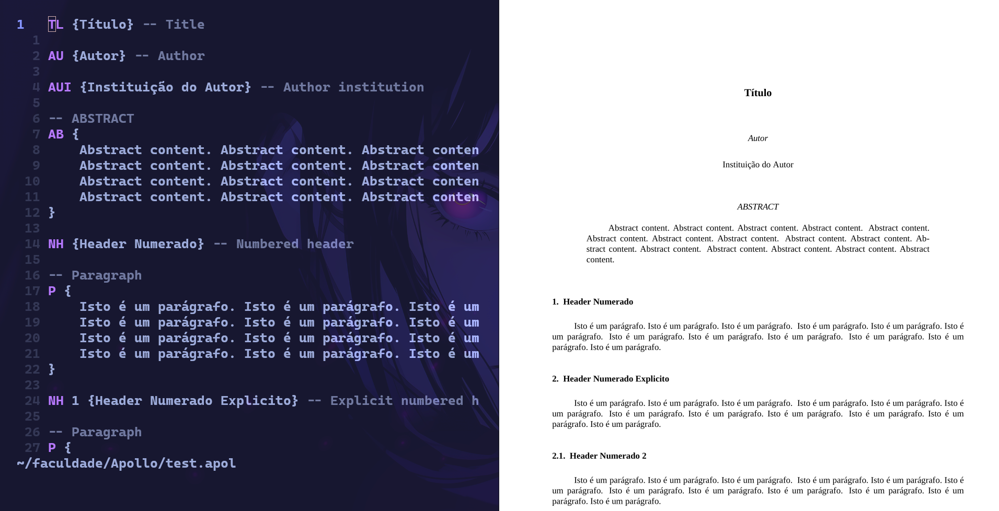

<div align="center">

# Apollo

##### Linguagem para criação de documentos PDF.


</div>

## Instalação

### Dependências

- [bash](https://www.gnu.org/software/bash/)
- [groff](https://www.gnu.org/software/groff/)
- [preconv](https://www.man7.org/linux/man-pages/man1/preconv.1.html)
- [pygmentize](https://github.com/dedalozzo/pygmentize) (opcional)

### Para Executar

Clone o repositório.

```console
git clone https://github.com/nilsojunior/Apollo
```

Rode o build script (nome do `.flex` e `.cup` devem ser iguais).

```console
./build.sh <programa>
```

Se o nome do arquivo for `pdfview.flex` e `pdfview.cup`.

```console
./build.sh pdfview
```

Rode o parser.

```console
java parser <arquivo>
```

## Syntax Highlight

É possível adicionar syntax highlight ao [nvim](https://github.com/neovim/neovim).
Crie o diretório `syntax` se não existir.

```console
mkdir ~/.config/nvim/syntax
```

Mova `apol.vim` para o diretório.

```console
mv apol.vim ~/.config/nvim/syntax/
```

Adicione na sua configuração.

```lua
vim.api.nvim_create_autocmd({ "BufRead", "BufNewFile" }, {
	pattern = { "*.apol" },
	callback = function()
		vim.bo.filetype = "apol"
	end,
})
```

## Uso

Exemplos de uso e todas as funcionalidades da linguagem
podem ser encontrados em [test.apol](test.apol).
